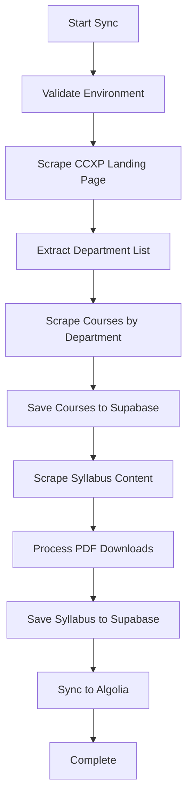

# @courseweb/data-sync

Course data synchronization tools for CourseWeb monorepo.

## Overview

This package provides utilities for synchronizing course data, syllabus information, and search indices from external sources. It has been redesigned to run data scraping operations directly instead of making HTTP calls to API endpoints, making it suitable for containerized deployment and scheduled execution.

## Features

- ✅ Direct course data scraping from CCXP system
- ✅ Syllabus content extraction and PDF handling
- ✅ Algolia search index synchronization
- ✅ Docker containerization for cloud deployment
- ✅ GitHub Actions CI/CD pipeline
- ✅ Comprehensive error handling and retry logic
- ✅ Environment validation
- ✅ Concurrent processing with rate limiting

## Quick Start

### Local Development

```bash
# Install dependencies
npm install

# Copy environment file
cp .env.example .env

# Edit .env with your credentials
# Run one-time sync
npm run sync:once

# Run scheduled sync (development)
npm run sync:scheduled
```

### Docker Usage

```bash
# Build the image
docker build -t courseweb-data-sync .

# Run one-time sync
docker run --env-file .env courseweb-data-sync

# Run with custom semester
docker run --env-file .env courseweb-data-sync tsx src/sync-courses.ts 11420

# Run scheduled sync (persistent container)
docker run -d --env-file .env --name courseweb-sync \
  courseweb-data-sync tsx src/update-courses.ts "0 8 * * *" 11420
```

### Docker Compose Usage

For a ready-to-use daily scraping service:

```bash
# Copy environment file and configure
cp .env.example .env

# Start scheduled daily sync service
docker-compose up -d

# Run one-time sync
docker-compose run --rm data-sync-once

# View logs
docker-compose logs -f data-sync

# Stop the service
docker-compose down
```

### Google Cloud Run Deployment

The Docker image is automatically built and pushed to GitHub Container Registry via GitHub Actions. You can deploy it to Google Cloud Run for periodic execution:

```bash
# Deploy to Cloud Run
gcloud run deploy courseweb-data-sync \
  --image ghcr.io/nthumodifications/courseweb-data-sync:latest \
  --platform managed \
  --region asia-east1 \
  --set-env-vars SUPABASE_URL=xxx,SUPABASE_SERVICE_ROLE_KEY=xxx,ALGOLIA_APP_ID=xxx,ALGOLIA_API_KEY=xxx \
  --max-instances 1 \
  --timeout 3600 \
  --memory 2Gi \
  --cpu 2 \
  --no-allow-unauthenticated

# Schedule periodic runs with Cloud Scheduler
gcloud scheduler jobs create http courseweb-sync-job \
  --location asia-east1 \
  --schedule "0 8 * * *" \
  --uri https://your-cloud-run-url.a.run.app \
  --http-method POST \
  --oidc-service-account-email your-service-account@project.iam.gserviceaccount.com
```

## Scripts

### Sync Once

Runs a one-time synchronization of course data:

```bash
npm run sync:once [semester]
```

This will:

- Scrape archived courses for the specified semester (defaults to 11420)
- Download and process syllabus data
- Update Algolia search index
- Exit when complete

### Scheduled Sync

Runs persistent scheduled synchronization:

```bash
npm run sync:scheduled [cronPattern] [semester]
```

This starts a persistent process that runs the sync operation on schedule.

### Docker Commands

```bash
# Build image
npm run docker:build

# Run container with environment file
npm run docker:run
```

## Usage

### From Root Workspace

```bash
# One-time sync
npm run runner:sync-courses

# Scheduled sync (persistent process)
npm run runner:update-courses

# Using workspace commands
npm run sync:once
npm run sync:scheduled
```

### Programmatic Usage

```typescript
import {
  syncCourses,
  startScheduledSync,
  scrapeArchivedCourses,
  scrapeSyllabus,
  syncCoursesToAlgolia,
  validateEnvironment,
} from "@courseweb/data-sync";

// One-time sync
const result = await syncCourses("11420"); // semester parameter optional

// Start scheduled sync
const job = startScheduledSync("0 8 * * *", "11420"); // cron pattern and semester optional

// Use individual functions
const env = validateEnvironment();
const courses = await scrapeArchivedCourses(env, "11420");
await scrapeSyllabus(env, "11420", courses);
await syncCoursesToAlgolia(env, "11420");
```

### Direct Function Usage

```typescript
import {
  scrapeArchivedCourses,
  scrapeSyllabus,
  syncCoursesToAlgolia,
  validateEnvironment,
  type SyncEnvironment,
} from "@courseweb/data-sync";

const env: SyncEnvironment = {
  SUPABASE_URL: "your-url",
  SUPABASE_SERVICE_ROLE_KEY: "your-key",
  ALGOLIA_APP_ID: "your-app-id",
  ALGOLIA_API_KEY: "your-api-key",
};

// Scrape courses and get results
const courses = await scrapeArchivedCourses(env, "11420");

// Process syllabus with scraped courses
await scrapeSyllabus(env, "11420", courses);

// Sync to search index
await syncCoursesToAlgolia(env, "11420");
```

## Environment Variables

The sync scripts require the following environment variables:

| Variable                    | Description               | Required |
| --------------------------- | ------------------------- | -------- |
| `SUPABASE_URL`              | Your Supabase project URL | ✅       |
| `SUPABASE_SERVICE_ROLE_KEY` | Supabase service role key | ✅       |
| `ALGOLIA_APP_ID`            | Algolia application ID    | ✅       |
| `ALGOLIA_API_KEY`           | Algolia admin API key     | ✅       |

Optional variables:

| Variable       | Description              | Default       |
| -------------- | ------------------------ | ------------- |
| `SEMESTER`     | Default semester to sync | `11420`       |
| `CRON_PATTERN` | Default cron schedule    | `"0 0 * * *"` |

## Configuration

### Default Semester

The default semester is `11420` (Spring 2026). You can override this by:

- Passing a different semester parameter to the functions
- Setting the `SEMESTER` environment variable
- Using command line arguments

### Schedule Pattern

The default cron pattern is `"0 0 * * *"` (daily at midnight UTC, which is 8:00 AM GMT+8).

Common patterns:

- `"0 8 * * *"` - Daily at 8:00 AM UTC
- `"0 0 * * 0"` - Weekly on Sunday at midnight
- `"0 0 1 * *"` - Monthly on the 1st at midnight

## Data Flow



## Error Handling

- **Retry Logic**: All network operations include exponential backoff retry
- **Graceful Failures**: Individual department/course failures don't stop the entire process
- **Detailed Logging**: Comprehensive logging with emojis for better visibility
- **Environment Validation**: Validates all required environment variables before starting
- **Timeout Protection**: Reasonable timeouts to prevent hanging operations

## Development

```bash
# Install dependencies
npm install

# Build the package
npm run build

# Development mode with watch
npm run dev

# Clean build artifacts
npm run clean

# Lint code
npm run lint

# Type check
npm run type-check

# Build Docker image
npm run docker:build

# Run in Docker
npm run docker:run
```

## CI/CD Pipeline

The package includes GitHub Actions workflow that:

1. **Builds** the Docker image on every push to main
2. **Pushes** to GitHub Container Registry (GHCR)
3. **Tags** with both commit SHA and `latest`
4. **Deploys** automatically on successful builds

The image is available at: `ghcr.io/nthumodifications/courseweb-data-sync:latest`

## Performance & Limits

- **Concurrent Processing**: Processes departments and courses in controlled batches
- **Rate Limiting**: Built-in delays to avoid overwhelming external services
- **Memory Efficient**: Processes data in chunks to handle large datasets
- **Timeout Protection**: 5-minute timeout for course scraping, 20-minute for syllabus
- **Retry Logic**: Up to 6 retries with exponential backoff

## Monitoring & Logs

The application provides detailed logging:

- 🚀 Process start/completion
- 📚 Course scraping progress
- 📝 Syllabus processing status
- 🔍 Algolia sync updates
- ❌ Error details with context
- 📊 Statistics and performance metrics

## Dependencies

### Runtime Dependencies

- `node-schedule`: For scheduled job execution
- `linkedom`: For HTML parsing in worker environment
- `@supabase/supabase-js`: Database operations
- `algoliasearch`: Search index management

### Development Dependencies

- `tsx`: TypeScript execution
- `tsup`: Build tooling
- `typescript`: Type checking
- Various linting and formatting tools

## Deployment Examples

### Cloud Run with Terraform

```hcl
resource "google_cloud_run_service" "courseweb_data_sync" {
  name     = "courseweb-data-sync"
  location = "asia-east1"

  template {
    spec {
      containers {
        image = "ghcr.io/nthumodifications/courseweb-data-sync:latest"

        env {
          name  = "SUPABASE_URL"
          value = var.supabase_url
        }

        env {
          name  = "SUPABASE_SERVICE_ROLE_KEY"
          value = var.supabase_key
        }

        # ... other env vars

        resources {
          limits = {
            memory = "2Gi"
            cpu    = "2000m"
          }
        }
      }

      timeout_seconds = 3600
    }
  }
}
```

### Kubernetes Deployment

```yaml
apiVersion: batch/v1
kind: CronJob
metadata:
  name: courseweb-data-sync
spec:
  schedule: "0 8 * * *"
  jobTemplate:
    spec:
      template:
        spec:
          containers:
            - name: data-sync
              image: ghcr.io/nthumodifications/courseweb-data-sync:latest
              env:
                - name: SUPABASE_URL
                  valueFrom:
                    secretKeyRef:
                      name: courseweb-secrets
                      key: supabase-url
              # ... other env vars
              resources:
                limits:
                  memory: "2Gi"
                  cpu: "2000m"
          restartPolicy: OnFailure
```

## Contributing

1. Fork the repository
2. Create a feature branch
3. Make your changes
4. Add tests if applicable
5. Submit a pull request

## License

MIT License - see LICENSE file for details.

## Notes

- Sync operations have timeout protections (5 minutes for courses, 20 minutes for syllabus)
- All operations include proper error handling and logging
- The containerized version exits after completion, suitable for scheduled cloud runs
- Docker image is automatically built and deployed via GitHub Actions
- Supports both one-time and scheduled execution modes
